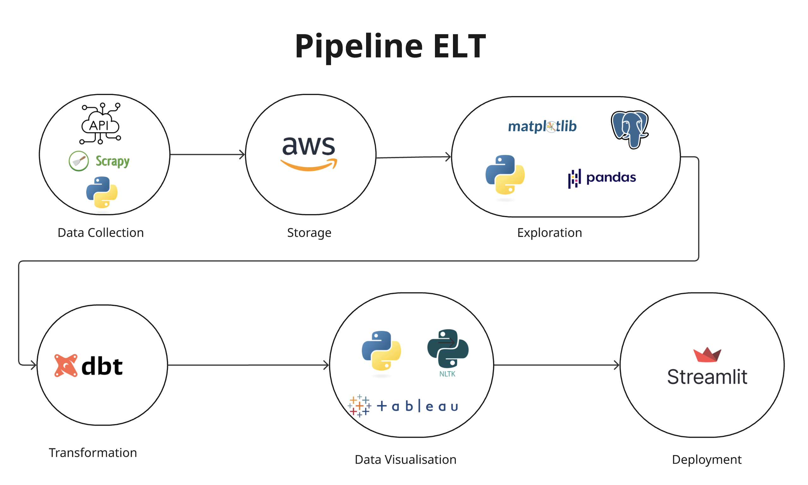

# Eurovision_App
This interactive web app, made by Ayla Abdullah, Neringa Šiožinytė, & Alexander Wamboldt, analyzes Eurovision data across time.

---

## 🌟 **Summary**

This Streamlit web app:

- Provides a **background** about the Eurovision Song Contest.
- Highlightes different factors of **Eurovision songs**, **contestants**, and **countries** that may play a role in their success.
- Gives you a **user-friendly interface** for exploring and visualizing Eurovision data to uncover surprising facts about the competition.
- Describes the **data** used for this app, and any limitations in its methods.

The app is organized into several sections:

- **Home** 🏠: Introduction to the project.
- **Background** 🗺️: A quick visual reference to the competitors' history in the contest, as well as facts on the winners and top 3 competitors.
- **Song Characteristics** 🎶: Visualizations analyzing different musical elements of Eurovision songs, showing how certain musical choices do better and worse in Eurovision.
- **Relationships** ❤️: Analysis and visualizations of national patterns in voting.
- **Betting** 💸: Examinations of how successful betting organizations are at predicting Eurovision wins.
- **Fun Facts** 🥳: It's not Eurovision if it's not at least a little weird. A collection of visualizations showing some of the funnier sides of the contest.
- **References** 🔍: Sources for the data used.

---

## 🤖 **Technology Stack**

The app is powered by:

- **matplotlib** 🗺️: For word cloud visualizations.
- **nltk** 🧮: For word cloud visualizations.
- **Pandas** 🐼: For data processing.
- **Python** 🐍: For the backend and for data manipulation.
- **Streamlit** 🌐: For the interactive app interface.
- **Tableau** 📈: For interactive data visualizations.
- **wordcloud** 🌩️: For word cloud visualizations.


---

## 📂 **App Structure**

The app is modular, organized into separate python files:

- `eurovision.py` — The App itself–only this file needs to be run to use this app.
- `home.py` — Introduction page.
- `background.py` — General information about countries' participation as well as winners and the Top 10.
- `song.py` — Analysis of the musical qualities of Eurovision songs.
- `relationships.py` — Deep dive into the political analysis of voting.
- `betting.py` — Analysis of betting odds for the competition.
- `fun.py` — Collection of funny, odd, and charming discoveries about Eurovision that have nothing to do with winning.
- `references.py` — Credits the data sources used for this app.

There are also folders for html files and data .csv files:
-`htmls`: contains html files connecting Tableau visualizations for the app.
-`data`: contains .csv files containing data used for this project.

---

## 🤯 **Features**

- **User-Friendly** 🧭: Easily navigate between different subject pages and data visualizations.
- **Interactive Maps** 🌍: Explore dynamic maps about Eurovision.
- **Deep Dives** 🌊: Discover the nuances of Eurovision music, politics, and gambling.

---

## ✔️ **Installation Instructions**

1. **Fork and Clone the repository**:

   ```bash
   git clone https://github.com/awamboldt/eurovision_app.git
   ```

2. **Install requirements**:

   ```bash
   pip install -r requirements.txt
   ```

3. **Download updates**:
    ```bash
    import nltk
    nltk.download('stopwords')
    ```

4. **Run the application**:

   ```bash
   streamlit run eurovision.py
   ```

---

## ✔️ **Online**

**Our App is also available [here](https://eurovision.streamlit.app/)**

---

## 🛩️ **Exploring the App**

- **Home** 🏠: Learn about the Eurovision Song Contest and this app.
- **Background** 🏅: See information about the contest's competitors, winners, and top finishers over time.
- **Song Characteristics** 🎶: Analyze detailed data related to the musical characteristics of Eurovision songs.
- **Relationships** 🤝: Discover the connections between countries in Eurovision voting.
- **Betting** 💸: Dig deep into which betting organizations do best at predicting Eurovision outcomes.
- **Fun Facts** 🤡: Find out which words appear the most in Eurovision lyrics, which countries don't get enough love, who likes to mix it up musically, and more.
- **References** 📚: See the sources that made this app possible.

---

## 💡 **Project Process**

- Song, vote, betting, and contestant data from referenced sourced and Wikipedia web scraping.
- Data cleaned using Python.
- Data transformed and key metrics built using dbt and SQL.
- Data visualizations made using Tableau as well as Matplotlib, nltk, and wordcloud.



---

## ✍🏾✍🏻 **Authors**

**Ayla Abdullah** 🦸🏾‍♀️ 
Superhuman patience to use her skills for something so stupid.

**Neringa Šiožinytė** 🧙🏻‍♀️
Ancient wisdom on Eurovision winners.

**Alexander Wamboldt** 🦹🏻‍♂️
Nefarious plotter of trivial projects.

---